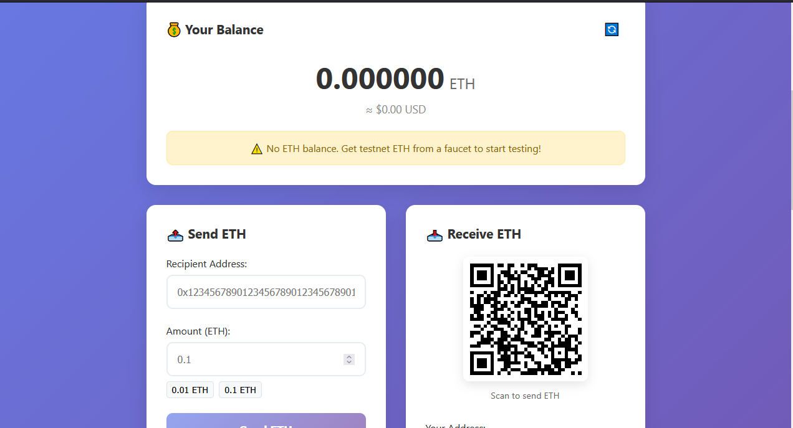

# 🏦 Ethereum Wallet

A secure and user-friendly Ethereum wallet application built with React and Hardhat. This application allows you to interact with the Ethereum blockchain, manage your ETH balance, and perform transactions with ease.

## 📸 Screenshot


*Ethereum Wallet Interface - Showing balance, send, and receive functionality*

## ✨ Features

- 🔐 Secure wallet connection via MetaMask
- 💰 Real-time ETH balance display
- 📤 Send ETH to any Ethereum address
- 📥 Receive ETH with QR code support
- 🔄 Transaction history tracking
- 🛠 Built with modern web3 technologies
- 🔗 Transaction tracking with Etherscan links
- 🌐 Multi-network support (Mainnet, Sepolia, Local)
- 🔐 Security-focused with helpful warnings
- 📱 Mobile-responsive design

## 🛠 Tech Stack

- **Frontend**: React 18, ethers.js v6
- **Smart Contracts**: Solidity 0.8.19
- **Development**: Hardhat
- **Styling**: Custom CSS
- **QR Codes**: qrcode library
- **Wallet**: MetaMask integration

## 🚀 Quick Start

### Prerequisites
- Node.js (v16 or later)
- npm (v8 or later) or yarn (v1.22 or later)
- [MetaMask](https://metamask.io/) browser extension
- Git (for cloning the repository)

### Installation

1. **Clone the repository**
   ```bash
   git clone https://github.com/secbyteX03/ethereum-wallet.git
   cd ethereum-wallet
   ```

2. **Install Dependencies**
   ```bash
   # Install root dependencies
   npm install
   
   # Navigate to frontend and install its dependencies
   cd frontend
   npm install
   cd ..
   ```

3. **Environment Setup**
   ```bash
   # Copy the example environment file
   cp .env.example .env
   ```
   
   Update the `.env` file with your configuration:
   ```
   # RPC URL for connecting to Ethereum networks
   ETH_RPC_URL=https://eth-sepolia.g.alchemy.com/v2/YOUR_API_KEY
   
   # Private key for deploying contracts (NEVER commit this!)
   PRIVATE_KEY=your_private_key_here
   
   # Optional: Etherscan API key for contract verification
   ETHERSCAN_API_KEY=your_etherscan_api_key
   ```

### 🏃‍♂️ Running Locally

#### 1. Start Local Development Network
Open a new terminal and run:
```bash
npx hardhat node
```
This will start a local Ethereum node with 20 test accounts, each with 10,000 test ETH.

#### 2. Deploy Smart Contracts
In a new terminal, deploy the contracts to your local network:
```bash
npx hardhat run scripts/deploy.js --network localhost
```

#### 3. Configure MetaMask
1. Open MetaMask and switch to "Localhost 8545" network (or add it if not present):
   - Network Name: Hardhat Local
   - RPC URL: http://127.0.0.1:8545
   - Chain ID: 31337
   - Currency Symbol: ETH

2. Import a test account:
   - Copy a private key from the Hardhat node output
   - In MetaMask, click on your account icon → Import Account
   - Paste the private key and click "Import"

#### 4. Start the Frontend
In a new terminal:
```bash
cd frontend
npm start
```
The application will open automatically at http://localhost:3000

## 🚀 Deployment Guide

### ⚙️ Network Configuration

#### 1. Local Development
```bash
# Start local Hardhat node with detailed gas reporting
npx hardhat node --show-accounts --no-deploy

# In a new terminal, deploy with gas reporting
npx hardhat run scripts/deploy.js --network localhost --show-stack-traces
```

#### 2. Testnet (Sepolia)
```bash
# Deploy with gas estimation
npx hardhat run scripts/deploy.js --network sepolia \
  --gasprice 2000000000 \
  --gaslimit 5000000
```

#### 3. Mainnet Deployment
```bash
# Dry run first (simulate deployment)
npx hardhat run scripts/deploy.js --network mainnet --dry-run

# Actual deployment (remove --dry-run when ready)
npx hardhat run scripts/deploy.js --network mainnet \
  --gasprice 30000000000 \
  --gaslimit 6000000 \
  --confirmations 3
```

### ⚡ Gas Optimization

#### Estimate Gas Usage
```bash
# Get detailed gas report
REPORT_GAS=true npx hardhat test

# Estimate deployment cost
npx hardhat run scripts/deploy.js --network <network> --gas
```

#### Gas Price Strategies
```javascript
// In hardhat.config.js
module.exports = {
  networks: {
    mainnet: {
      url: process.env.ETH_RPC_URL,
      gasPrice: 'auto',  // Uses ethers' gas price oracle
      gasMultiplier: 1.2, // Adds 20% to estimated gas
      timeout: 20000,    // 20 seconds
    },
    sepolia: {
      url: process.env.SEPOLIA_RPC_URL,
      gasPrice: 2000000000, // 2 Gwei
      gas: 5000000,        // Gas limit
    }
  }
};
```

### 🔍 Contract Verification

#### Verify on Etherscan
```bash
# Verify contract (mainnet)
npx hardhat verify --network mainnet \
  --contract contracts/TestFaucet.sol:TestFaucet \
  <CONTRACT_ADDRESS> \
  <CONSTRUCTOR_ARGS>

# Verify with constructor arguments
npx hardhat verify --network mainnet \
  --constructor-args arguments.js \
  <CONTRACT_ADDRESS>
```

#### Verification Troubleshooting
- Ensure your contract is compiled with optimization if used in deployment
- Double-check constructor arguments
- Verify network and contract address are correct
- For complex verifications, use the `--debug` flag

### 🛡️ Security Best Practices

1. **Always** test on testnet first
2. Use `--dry-run` to simulate deployments
3. Set appropriate gas limits and prices
4. Consider using a multisig wallet for production deployments
5. Keep your private keys secure using environment variables
6. Monitor gas prices using [ETH Gas Station](https://ethgasstation.info/)

## 📁 Project Structure

```
ethereum-wallet/
├── contracts/           # Smart contracts
│   └── TestFaucet.sol   # Test faucet contract
├── scripts/            # Deployment scripts
│   └── deploy.js       # Contract deployment script
├── test/               # Smart contract tests
│   └── TestFaucet.test.js
├── frontend/           # React frontend
│   ├── public/         # Static files
│   └── src/            # Source files
│       ├── components/ # React components
│       │   ├── BalanceDisplay.js
│       │   ├── ConnectButton.js
│       │   ├── ReceiveSection.js
│       │   └── SendForm.js
│       ├── App.js      # Main application component
│       └── App.css     # Global styles
├── hardhat.config.js   # Hardhat configuration
└── package.json        # Project dependencies
```

## 🔐 Security Considerations

### Frontend Security
- Private keys never leave MetaMask
- All transactions require explicit user confirmation
- Comprehensive input validation for addresses and amounts
- Clear error messages and transaction warnings
- Secure handling of sensitive data

### Smart Contract Security
- Minimal contract surface area
- Comprehensive test coverage
- Reentrancy protection mechanisms
- Proper access controls implementation
- Regular security audits

### Best Practices
- Always verify transaction details before confirming
- Start with small test amounts
- Use testnet for development and testing
- Keep MetaMask and dependencies updated
- Never share private keys or seed phrases
- Be cautious of phishing attempts

## 🐛 Troubleshooting

### Common Issues

#### MetaMask Not Detected
- Ensure MetaMask extension is installed and enabled
- Refresh the page after installing MetaMask
- Check if you have any script blockers interfering
- Try disabling other wallet extensions temporarily

#### Transaction Failures
- Verify you have sufficient ETH for gas fees
- Double-check the recipient address is correct
- Try increasing the gas limit in MetaMask
- Check if you're on the correct network
- Look for transaction errors in the browser console

#### Balance Not Updating
- Click the refresh button in the wallet
- Ensure you're connected to the correct network
- Wait for transaction confirmations (usually 12-15 blocks)
- Check Etherscan for transaction status

#### Local Development Issues
- Make sure Hardhat node is running: `npx hardhat node`
- Reset MetaMask account in advanced settings
- Verify localhost:8545 is accessible
- Check for port conflicts with other applications

## 🤝 Contributing

We welcome contributions! Please follow these steps:

1. Fork the repository
2. Create a feature branch: `git checkout -b feature/your-feature`
3. Commit your changes: `git commit -m 'Add some feature'`
4. Push to the branch: `git push origin feature/your-feature`
5. Open a Pull Request

### Code Style
- Follow existing code style and patterns
- Add comments for complex logic
- Write tests for new features
- Update documentation when necessary

### Commit Message Format
```
<type>(<scope>): <description>

[optional body]

[optional footer]
```

Example:
```
feat(send): add transaction confirmation dialog

Adds a confirmation dialog before sending transactions to prevent accidental sends.

Fixes #123
```

## 📄 License

This project is licensed under the MIT License - see the [LICENSE](LICENSE) file for details.

## 🙏 Acknowledgments

- [MetaMask](https://metamask.io/) for wallet integration
- [Hardhat](https://hardhat.org/) for development environment
- [ethers.js](https://docs.ethers.org/) for Ethereum interactions
- [OpenZeppelin](https://openzeppelin.com/) for smart contract libraries

## 📞 Support

If you need help or have questions:

1. Check the [troubleshooting](#-troubleshooting) section
2. Search existing [GitHub issues](https://github.com/secbyteX03/ethereum-wallet/issues)
3. Open a new issue with detailed information

---

⚠️ **Disclaimer**: This software is provided "as is" without any warranties. Always test with small amounts first and never share your private keys or seed phrases.

🐛 Troubleshooting
Common Issues

MetaMask not detected

Install MetaMask browser extension
Refresh the page


Transaction fails

Check you have enough ETH for gas
Verify recipient address is correct
Try increasing gas price in MetaMask


Balance not updating

Click the refresh button
Check you're on the correct network
Wait for blockchain confirmation


Local node issues

Restart Hardhat node: npm run node
Reset MetaMask account in advanced settings
Check localhost:8545 is accessible


🚀 Deployment
Deploy to Testnet
bash# Sepolia deployment
npm run deploy
Deploy to Mainnet (Use with caution!)
bash# Update hardhat.config.js with mainnet config
# Deploy with proper gas settings
npx hardhat run scripts/deploy.js --network mainnet
📈 Next Steps / Improvements
Here are suggested enhancements for learning and expanding the wallet:

Token Support

Add ERC-20 token balance display
Token sending functionality
Token list management


Enhanced UX

Transaction history display
Gas price estimation and customization
Address book for frequent recipients


Advanced Features

ENS (Ethereum Name Service) lookup
Multi-signature wallet support
Hardware wallet integration


DeFi Integration

Swap functionality (Uniswap integration)
Staking interfaces
Yield farming dashboards


Security Enhancements

Transaction simulation before sending
Phishing protection warnings
Advanced address validation


Mobile & PWA

Progressive Web App features
Mobile-optimized interface
Offline functionality


Analytics & Insights

Portfolio tracking
Price charts integration
Transaction analytics


Social Features

Contact management
Payment requests
Splitting bills functionality


🤝 Contributing
We welcome contributions! Here's how to get started:
Branch Naming Convention

feature/description - New features
fix/description - Bug fixes
docs/description - Documentation updates
refactor/description - Code refactoring

Suggested Commit Messages

feat: add token balance display
fix: resolve transaction timeout issue
docs: update setup instructions
style: improve mobile responsiveness
test: add unit tests for SendForm component
refactor: optimize balance fetching logic

Development Workflow

Fork the repository
Create a feature branch
Make your changes
Add tests if applicable
Update documentation
Submit a pull request

📄 License
This project is licensed under the MIT License - see the LICENSE file for details.
🙏 Acknowledgments

OpenZeppelin for smart contract best practices
MetaMask for wallet integration
Hardhat for development framework
ethers.js for Ethereum interactions

📞 Support
If you have questions or need help:

Check the troubleshooting section above
Search existing GitHub issues
Create a new issue with detailed description
Join our community discussions


⚠️ Disclaimer: This wallet is for educational purposes. Always test on testnets before using with real funds. The developers are not responsible for any loss of funds.

## How to Run Locally

Here are the exact terminal commands to get started:

```bash
# 1. Clone and setup
git clone https://github.com/secbyteX03/ethereum-wallet.git
cd ethereum-wallet

ERC-20 Token Support - Add functionality to view, send, and receive ERC-20 tokens with token list management
Advanced Gas Management - Implement gas price estimation, custom gas limits, and EIP-1559 fee suggestions
ENS Integration - Add Ethereum Name Service lookup for human-readable addresses (.eth domains)
Transaction History - Display past transactions with filtering, sorting, and export functionality
Address Book - Allow users to save and manage frequently used addresses with labels
WalletConnect Integration - Enable connection to dApps and mobile wallets beyond MetaMask
Multi-Network DeFi - Add support for Layer 2 networks (Polygon, Arbitrum) and cross-chain bridges
Portfolio Analytics - Integrate price tracking, portfolio value charts, and P&L calculations

